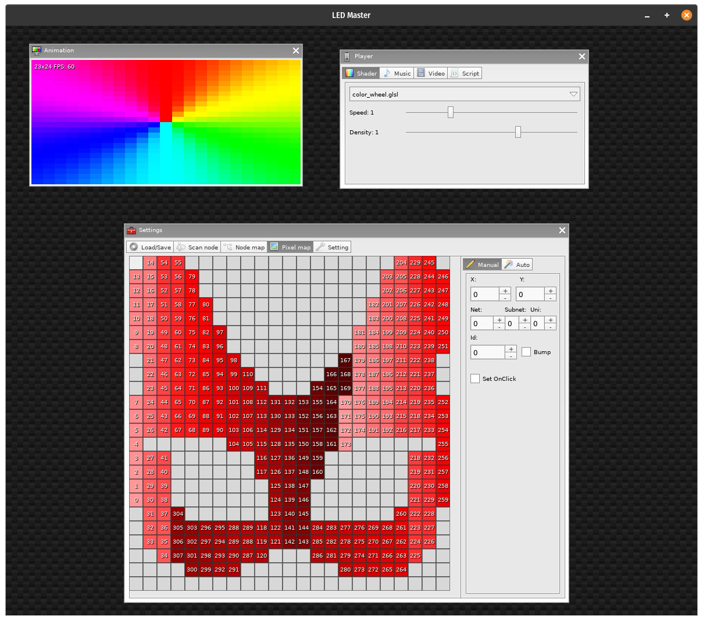
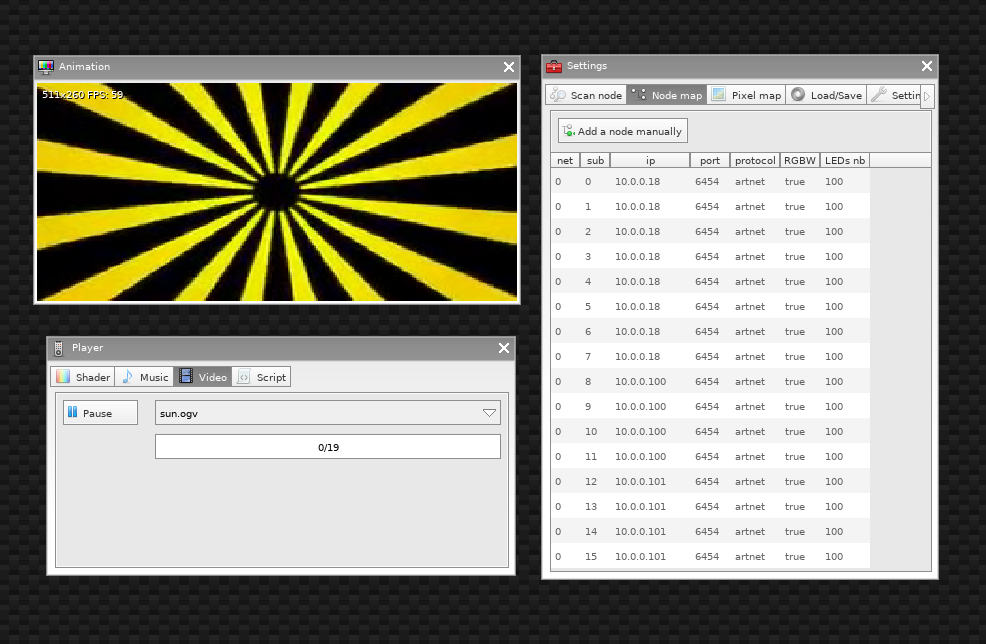

LED_Master
============

LEDs master is a software for controlling big RGB LED matrix.

It work on PC ( Windows / OSX / Linux ) and on smartphone ( Android / IOS )

You can load shaders, musics, microphone, videos and custom scripts to create live animation.

And stream them to nodes using art-net or to my [Wifi LEDs driver](https://antoine.doussaud.org/esp32_LED) using Zlib compression

<!--  -->

## Dependencies
 - You need to install [Löve](https://love2d.org/#download)

## Usage
### Get the code.
1. Clone the repository. `git clone git@github.com:spectrenoir06/LED_master.git`
2. Clone the submodules: `git submodule update --init --recursive`
### Run it
#### Linux
`love .`
#### OSX
`/Applications/love.app/Contents/MacOS/love .`
#### Windows
`"C:\Program Files\LOVE\love.exe" --console .`
#### More info
[Here](https://love2d.org/wiki/Getting_Started)

### Add ressource
- You can add shader / music / video / script
- For this you need to add your ressource on the ressource folder locate at:
  - Windows: `C:\Users\user\AppData\Roaming\LOVE`
   - Mac: `/Users/user/Library/Application Support/LOVE`
   - Linux: `~/.local/share/love`
- Or you can directly drag and drop your files on the window when LEDs master is running.
- video must be convert to ogv `ffmpeg -i input.mp4 -codec:v libtheora -qscale:v 7 -codec:a libvorbis -qscale:a 1 output.ogv`
)

## Roadmap

- Work
  - Protocol
    - [x] Art-net
    - [x] RGB888
    - [x] RGB565
    - [x] RLE888
    - [x] BRO888 (brotli)
    - [x] Z888 (zlib)
    - [x] udpx
  - Player
    - Shader
      - [x] Fragment Shader
      - [x] External parameter
      - [x] FFT sound input ( FFT => canvas => shader:send )
      - [x] Drag and drop
    - Music
      - [x] Music Loader
      - [x] FFT visualization
      - [x] Microphone In
      - [x] Aux In
      - [x] Drag and drop
    - Video
      - [x] Video Loader
      - [x] Drag and drop
    - Script
      - [x] Custom script loader
      - [x] Drag and drop
      - [ ] Doc
  - Settings
    - Scan Node
      - [x] Art-net
      - [ ] Octo-LED ()
    - Node map
      - [x] Viewer
      - [x] Editor
    - Pixel mapping
      - [x] Viewer
      - [x] Editor
    - Load/save Json
      - [x] Load
      - [x] Save
      - [x] Drag and drop
    - Canvas setting
      - [x] Canvas size
      - [x] Brightness
      - [x] White mode
  - Animation
    - [ ] Loader
    - [ ] Editor
    - [ ] Saver
    - [ ] FTP Upload
  - Compatibility ( need test )
    - [x] Linux
    - [x] Windows
    - [x] OSX
    - [x] Android
    - [ ] iOS
    - [x] Raspberry Pi
    - [x] Nintendo Switch
  - Ideas
    - Screen grabber
